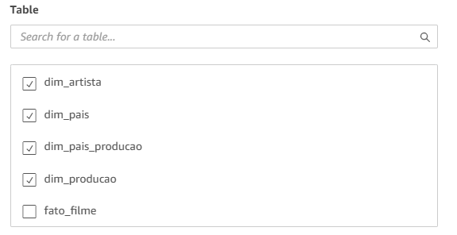

# Desafio 

# Perguntas

Fiz algumas alterações nas perguntas, mas as seguintes questões foram respondidas na minha análise:

1. Existe algum país de origem que tenha uma correlação direta com a alta popularidade dos filmes, ou a popularidade é mais distribuída entre os países?
2. Qual a duração média dos filmes de Drama/Romance?
3. Quais países mais produzem filmes de Drama/Romance?
4. Quais são os 10 filmes mais bem avaliados no gênero Drama/Romance?
5. Filmes em quais idiomas tendem a ser mais populares?
6. Há algum padrão ou agrupamento na duração dos filmes de Drama/Romance, como picos em certas faixas de tempo?
7. Qual é o continente com a maior diversidade de idiomas nos filmes?
8. Os filmes mais longos tendem a receber notas mais altas, ou há exceções notáveis?
9. Qual é a média de idade dos atores que atuam em filmes de Drama/Romance?
10. Qual foi o ano em que mais filmes de Drama/Romance foram lançados?

#
Antes de fazer com as configurações no QuickSight, precisei voltar à Sprint 9 para corrigir duas colunas que eu não havia tratado anteriormente. Ajustei essas colunas para garantir que os dados estivessem corretos e bem estruturados antes de utilizá-los na ferramenta de visualização.

[script.py](../Desafios/script.py)

Fiz essa modificação nessa parte para excluir alguns IDs que identifiquei durante a análise no Athena. Isso foi necessário para garantir que os dados estivessem mais limpos e coerentes para a visualização no QuickSight.

Esse trecho do código que mudei faz o tratamento de colunas que contêm listas aninhadas dentro do DataFrame no Spark.

* A função explode() foi usada para dividir a lista em múltiplas linhas.
* A coluna origin_country contém uma lista de países, cada país será transformado em uma nova linha.
* Isso significa que se um filme tem mais de um país de origem, ele será duplicado para cada país na nova estrutura.

* Na production_countries é uma lista de estruturas (structs) dentro do DataFrame.
* O explode() também divide essa lista em várias linhas, uma para cada país de produção.

* Depois de explodir a coluna production_countries, cada linha contém uma struct com informações como nome do país e código do país (ISO 3166-1).
* Aqui, eu selecionei apenas o código do país (iso_3166_1), substituindo a coluna original.

Por fim, criei uma nova tabela dimensional e a adicionei à tabela fato.

Após isso, rodei o código no Glue, executei o crawler e acessei as tabelas para verificar se estava tudo correto.

Depois disso, a primeira coisa que fiz foi criar uma conta no QuickSight, conforme as instruções do desafio.

Após a criação, apareceu uma tela semelhante à da imagem abaixo. Em seguida, cliquei em __Datasets__ e depois em __New Dataset__ para começar a configuração dos dados.

Depois de clicar em Athena, dei um nome para o meu data source e continuei com a configuração.

Após isso, selecionei o database chamado camada_refined e escolhi a tabela fato_filmes. Em seguida, cliquei em Edit/Preview Data para visualizar e editar os dados antes de prosseguir.

Então, apareceu uma página informando que eu não tinha permissão para me conectar. 

Para resolver isso, fui até o console da AWS, acessei o IAM, cliquei em Roles e pesquisei por QuickSight. Depois, selecionei a role correspondente e cliquei em Add Permissions. Em seguida, adicionei as seguintes políticas necessárias para garantir o acesso adequado.

Depois que as permissões foram adicionadas corretamente, a conexão funcionou. Em seguida, cliquei em Add Data -> Datasource, selecionei o nome do Datasource que criei anteriormente e escolhi as tabelas dimensionais para adicionar ao QuickSight.

Para estabelecer as relações entre as tabelas, cliquei nas duas bolinhas rosas que aparecem entre elas. Em Join Type, selecionei Inner Join, garantindo que apenas os registros correspondentes fossem mantidos. Em Join Clauses, escolhi os IDs correspondentes para conectar as tabelas corretamente. Repeti esse processo para todas as tabelas dimensionais e a tabela fato.

Depois ficou assim 

Para criar o dashboard, a primeira coisa que fiz foi acessar o site [Color Hunt](https://colorhunt.co/) e escolher uma paleta de cores que combinasse com o meu tema, que é Romance/Drama. Depois de definir a paleta, fui até o QuickSight, cliquei em Edit -> Themes -> My Themes e criei um tema personalizado com as cores selecionadas.
Também criei uma imagem com um título no Canva para adicionar ao meu dashboard, deixando a apresentação mais visual e organizada.

Antes de começar a criar os gráficos, criei alguns campos calculados para facilitar a visualização dos dados:

* idade_atores: calculei a idade que os atores tinham quando participaram do filme.

* idioma_continente: agrupei os idiomas por continente.

* idioma: substituí as siglas dos idiomas pelos seus respectivos nomes para facilitar a compreensão, já que eu não conhecia todas as siglas.

* países: substituí as siglas dos países pelos seus nomes completos, tornando a visualização mais intuitiva.

Agora vou falar sobre os meus gráficos. Para cada um, vou apresentar a pergunta analisada, uma breve explicação e um print do gráfico que criei para responder à questão.

1. Existe algum país de origem que tenha uma correlação direta com a alta popularidade dos filmes, ou a popularidade é mais distribuída entre os países?

    * Identificar se há um ou mais países que dominam a produção de filmes populares em Drama/Romance ou se há uma distribuição mais equilibrada. Isso pode indicar tendências culturais e a força da indústria cinematográfica de certos países no gênero.

    

    * __CONCLUSÃO__
O gráfico revela que os Estados Unidos é, de longe, o país que mais produz filmes populares do gênero Drama/Romance. O Canadá ocupa o segundo lugar, com um número bem menor, mas ainda significativamente superior ao dos demais países. China, Índia e Japão também se destacam, enquanto países europeus como Reino Unido, Alemanha e França apresentam uma representatividade menor. Após os líderes, há uma queda acentuada na quantidade de filmes populares de outros países, sugerindo que o sucesso do gênero está mais concentrado em nações com indústrias cinematográficas consolidadas.

2. Qual a duração média dos filmes de Drama/Romance?

    * Ter uma noção da duração típica desses filmes pode ajudar a entender o padrão de consumo do público. Filmes muito curtos podem indicar histórias mais simples, enquanto filmes mais longos podem sugerir tramas mais profundas e elaboradas.

    

    * __CONCLUSÃO__
Os filmes de Drama/Romance têm uma duração média de 103 minutos (1h43min), o que está dentro do padrão típico de longas-metragens. Esse tempo sugere um equilíbrio entre desenvolvimento emocional e retenção do público, sendo mais longos que comédias, mas mais curtos que dramas épicos.

3. Quais países mais produzem filmes de Drama/Romance?

    * Descobrir os países que mais investem nesse gênero pode mostrar onde há uma maior demanda ou tradição em narrativas dramáticas e românticas. Isso pode revelar influências culturais e cinematográficas regionais.

    

    * __CONCLUSÃO__
Utilizei um gráfico de nuvem de palavras, onde o tamanho das palavras representa a frequência de produção de filmes do gênero Drama/Romance em cada país. Os Estados Unidos aparecem como o maior produtor, seguido por Índia, China e Japão, destacando a força dessas indústrias cinematográficas no gênero. Países como França, Reino Unido, Alemanha e Brasil também estão presentes, mas com um volume menor. A diversidade de países na nuvem indica que o gênero é popular globalmente, embora sua produção esteja mais concentrada em algumas regiões.

4. Quais são os 10 filmes mais bem avaliados no gênero Drama/Romance?

    * Compreender quais filmes são mais bem avaliados pode revelar padrões em elementos como roteiro, elenco e direção que os tornam marcantes para o público e crítica. Isso também pode ajudar a identificar diretores, roteiristas e atores mais influentes no gênero.

    

    * __CONCLUSÃO__
Este gráfico de tabela exibe os 10 filmes de Drama/Romance com as maiores notas médias, que variam de 7.2 a 7.6, sendo a mais alta atribuída ao filme Hepta: The Last Lecture. A consistência das avaliações sugere uma estabilidade na recepção do gênero. A lista inclui títulos de diferentes países e idiomas, indicando que filmes bem avaliados não estão restritos a um único mercado. Além de produções populares, como Me Before You, há também filmes menos conhecidos, evidenciando uma diversidade de alcance. Acredito que as notas médias não sejam mais altas devido à redução significativa dos dados nas etapas anteriores, eliminando registros com valores nulos e outras inconsistências.

5. Filmes em quais idiomas tendem a ser mais populares?

    * Avaliar a relação entre idioma e popularidade pode indicar se há um viés para determinadas línguas, como inglês e francês, ou se filmes em idiomas menos falados também conseguem alcançar grande sucesso. Isso pode estar ligado à acessibilidade e distribuição global.

    

    * __CONCLUSÃO__
O gráfico revela que os filmes em inglês são amplamente mais populares do que os de qualquer outro idioma, evidenciando o domínio de Hollywood e a ampla distribuição dessas produções. Idiomas asiáticos, como chinês, japonês, hindi e coreano, aparecem em seguida, refletindo o crescimento de suas indústrias cinematográficas, impulsionadas por fenômenos como os doramas. Já os idiomas europeus, como francês, espanhol e alemão, possuem menor impacto na popularidade, apesar de sua forte tradição no cinema. Isso sugere que a acessibilidade e a distribuição global desempenham um papel crucial na popularidade dos filmes.

6. Há algum padrão ou agrupamento na duração dos filmes de Drama/Romance, como picos em certas faixas de tempo?

    *  Identificar se há faixas de tempo mais comuns (ex.: 90-110 min, 120-140 min) pode mostrar preferências do público e dos estúdios em relação à duração ideal para esse tipo de filme. Picos de frequência podem indicar o formato mais aceito para manter o engajamento do espectador.

    

    * __CONCLUSÃO__
O gráfico mostra a distribuição da duração dos filmes de Drama/Romance, indicando que a maioria deles tem entre 74 e 134 minutos, com picos em torno de 84 a 104 minutos. Isso sugere que essa faixa de duração é a mais comum e possivelmente a mais bem recebida pelo público e pelos estúdios. Filmes com durações muito curtas (menos de 70 minutos) ou muito longas (acima de 130 minutos) são menos frequentes, indicando que histórias desse gênero geralmente seguem um padrão de tempo para equilibrar desenvolvimento narrativo e envolvimento do espectador.

7. Qual é o continente com a maior diversidade de idiomas nos filmes?

    *  Avaliar a diversidade linguística nos filmes por continente pode revelar a riqueza cultural das produções cinematográficas e quais regiões investem mais em produções multilíngues. Isso também pode apontar para mercados mais abertos à diversidade cultural.

    

    * __CONCLUSÃO__
O gráfico mostra a distribuição de idiomas dos filmes por continente, indicando que a Ásia domina a diversidade linguística nos filmes, seguida por uma categoria Global(inglês), que sugere produções multilíngues ou amplamente distribuídas. Outras combinações, como Europa/África e Europa/América/África, aparecem em menor proporção, mostrando que filmes com múltiplas influências linguísticas são menos frequentes. A Europa e a América/Europa representam uma parcela pequena, sugerindo que a diversidade de idiomas nos filmes europeus é mais limitada em comparação com a Ásia.

8. Os filmes mais longos tendem a receber notas mais altas, ou há exceções notáveis?

    * Descobrir se há uma relação entre a duração e a nota dos filmes pode indicar se filmes mais longos são percebidos como mais profundos e complexos (e, portanto, bem avaliados) ou se há um ponto de saturação onde o tempo de exibição prejudica a experiência do espectador.

    

    * __CONCLUSÃO__
O gráfico analisa a relação entre a duração dos filmes e suas avaliações médias. A dispersão dos pontos sugere que não há uma correlação clara entre filmes mais longos e notas mais altas, pois há filmes bem avaliados em diversas durações. No entanto, a maioria dos filmes concentra-se entre 80 e 130 minutos, com algumas exceções mais curtas ou mais longas. Isso indica que, embora filmes mais longos possam ser bem avaliados, a duração por si só não garante uma melhor recepção pelo público.

9. Qual é a média de idade dos atores que atuam em filmes de Drama/Romance?

    * Avaliar a idade média dos atores pode indicar padrões de escolha de elenco para esse gênero. Pode ser que existam faixas etárias predominantes, como jovens para romances adolescentes ou atores mais experientes para dramas profundos.

    

    * __CONCLUSÃO__
O gráfico indica que a idade média dos atores em filmes de Drama/Romance é de 37 anos, sugerindo que esses gêneros costumam ter elencos mais adultos. Isso pode refletir uma preferência por narrativas maduras e complexas, abordando temas profundos sobre relacionamentos e emoções. No entanto, acredito que a idade média poderia ser menor, considerando a quantidade de filmes de romance e drama adolescente. Como os dados foram bastante reduzidos nas etapas anteriores devido à remoção de valores nulos e inconsistências, esse fator pode não ter sido refletido no resultado final.

10. Qual foi o ano em que mais filmes de Drama/Romance foram lançados?

    * Identificar o pico de lançamentos pode indicar tendências históricas no cinema, como períodos de alta produção para esse gênero. Isso pode estar relacionado a movimentos cinematográficos, mudanças na demanda do público ou avanços na indústria do entretenimento.

    

    * __CONCLUSÃO__
O gráfico revela que 2016 foi o ano com mais estreias de filmes de Drama/Romance, indicando um possível pico na produção desse gênero. Esse aumento pode estar relacionado a tendências do mercado cinematográfico, maior demanda do público por histórias emocionantes nesse período ou até o impacto de sucessos que impulsionaram novas produções. Também pode refletir mudanças na indústria, como avanços no streaming, que facilitaram a distribuição de filmes do gênero.

E este é o dashboard completo, reunindo todas as visualizações e análises que realizei.

[Dashboard](../Desafios/Dashboard_movies_romance_drama.pdf)

