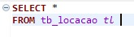
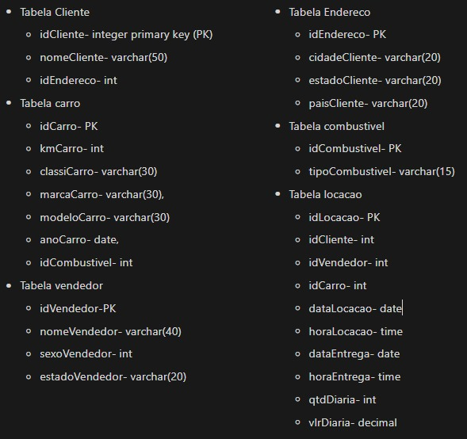
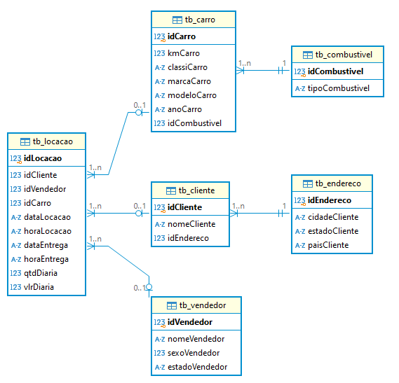
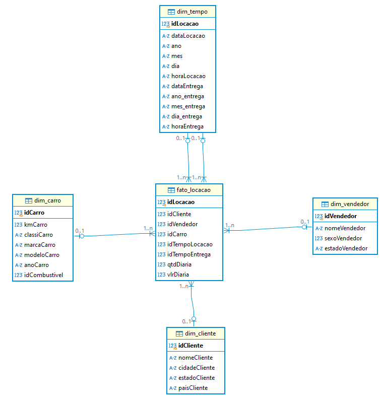

# Desafio 

## Etapa 1- Normalização dos dados
Comecei o desafio baixando o arquivo da concessionária e importando-o para o DBeaver, usando o SQLite. Em seguida, executei o comando abaixo para visualizar todas as tabelas e verificar se havia algum dado incorreto. Essa análise inicial foi essencial para que eu pudesse iniciar o processo do desafio.

Após analisar a tabela, identifiquei três colunas com dados inconsistentes. A primeira e a segunda era as colunas _dataLocacao_ e _dataEntrega_ onde as datas apareciam em um formato incomum, o que dificultava a leitura e organização. Decidi que, ao criar as tabelas, ajustaria essas datas para um formato mais adequado, garantindo consistência e padronização.

A terceira coluna com problemas era _horaLocacao_. Notei que os horários estavam misturados em dois formatos: horários iguais ou superiores a 10:00 estavam no formato HH:MM, enquanto horários menores que 10:00 apareciam como H:MM, sem o zero à esquerda. Para manter a uniformidade, planejei ajustar todos os horários para o formato HH:MM, adicionando o zero à esquerda em horários antes das 10:00.

Após identificar os dados inconsistentes, percebi que seria mais eficiente separar as tabelas para facilitar as consultas futuras. Por isso, organizei o nome de cada tabela e defini o conteúdo de cada uma, registrando tudo no Notion(imagem abaixo) para referência e organização.

#### Após concluir todas essas etapas, iniciei a criação da query. Agora, vou mostrar um pouco do que fiz.
Primeiro, removi tabelas que já existiam para evitar conflitos com a criação das novas tabelas, utilizando **DROP TABLE IF EXISTS** em cada tabela que seria criada. A partir disso, criei as seguintes tabelas normalizadas:

* **tb_combustivel**: Contém as informações sobre os tipos de combustível, identificados por idCombustivel e tipoCombustivel.

* **tb_carro**: Armazena os detalhes dos carros, como quilometragem, classificação, marca, modelo, ano, e o tipo de combustível usado. A coluna idCombustivel é uma chave estrangeira referenciando tb_combustivel.

* **tb_endereco**: Armazena os dados de localização dos clientes, incluindo cidade, estado e país.

* **tb_cliente**: Contém nome dos clientes, com idCliente como chave primária e idEndereco como chave estrangeira, ligando-o à tabela tb_endereco.

* **tb_vendedor**: Armazena informações sobre os vendedores, incluindo nome, sexo e estado.

Após criar essas tabelas, realizei inserções de dados usando **INSERT INTO ... SELECT DISTINCT ... from tb_locacao** para transferir dados da tabela original (tb_locacao) para as tabelas recém-criadas, evitando duplicatas.

Em seguida, renomeei a tabela original tb_locacao para tb_locacao_nova e criei uma nova tabela tb_locacao, estruturando-a com chaves estrangeiras para associar clientes, vendedores e carros. 

Lembra que no início, eu identifiquei uma inconsistência nos dados da coluna horaLocacao, onde os horários estavam em diferentes formatos. Tentei ajustar o formato para HH:MM de várias maneiras, para que os horários menores que 10:00, tivessem o zero à esquerda. Apesar da ajuda dos meus colegas, não consegui resolver o problema. Sempre que eu tentava, o sistema exibia erro, ou os horários abaixo de 10:00 eram registrados como null. Por isso, decidi manter o formato original.

Consegui, no entanto, formatar as datas nas colunas dataLocacao e dataEntrega, que estavam em um padrão estranho. Ajustei-as para o formato YYYY-MM-DD, inserindo hifens para melhor legibilidade.

Finalmente, removi a tabela temporária tb_locacao_nova, mantendo apenas a estrutura normalizada.

Você pode ver o meu código no link abaixo: 

[normalização_dos_dados](https://github.com/Rafaapsantos/CompassUol_Programa_de_bolsas/blob/main/Sprint%202/Desafios/normalizacao_dos_dados.sql)

E esse é o desenho da modelagem relacional após a normalização 

### Etapa 2- Modelagem Dimensional
Iniciei a segunda etapa do projeto desenvolvendo o código para a modelagem dimensional. Conforme mencionado no vídeo e nas instruções do desafio, comecei utilizando _views_ para criar as tabelas de dimensões e a tabela fato. No entanto, após a execução, percebi que, ao visualizar o diagrama, as tabelas de dimensões não estavam conectadas à tabela fato. Pesquisando em fontes externas, descobri que _views_ não permitem a criação de restrições de chaves estrangeiras.

Após discutir a questão com uma colega do meu squad, decidi não utilizar _views_ e, em vez disso, optei por criar _tables_.

#### Agora, vou mostrar um pouco do que fiz.

Primeiro, removi as tabelas existentes para evitar conflitos na criação de novas tabelas, usando o comando **DROP TABLE IF EXISTS** para cada tabela que seria criada. A partir disso, criei as seguintes tabelas dimensionais e a tabela fato: 

* **dim_carro**: Tabela que armazena informações sobre carros, como: idCarro, kmCarro,classiCarro, marcaCarro, modeloCarro, anoCarro e idCombustivel que é a chave que referencia o tipo de combustível, obtida de uma junção com a tabela tb_combustivel.

* **dim_cliente**: Tabela que contém informações sobre os clientes, com as seguintes colunas: idCliente, nomeCliente. cidadeCliente, estadoCliente e paisCliente também são colunas de dim_cliente mas são dados de localização do cliente, extraídos de uma junção com a tabela tb_endereco.

* **dim_vendedor**: Tabela que armazena dados dos vendedores, incluindo: idVendedor, nomeVendedor, sexoVendedor, estadoVendedor

**OBS=** ESSAS DUAS ÚLTIMAS TABELAS, EU VOU EXPLICAR CADA COLUNA. 

Conforme mencionado no vídeo, é sempre recomendável criar uma tabela dimensão específica para o tempo. Inicialmente, considerei criar duas tabelas separadas: uma para _dataLocacao_ e _horaLocacao_, e outra para _dataEntrega_ e _horaEntrega_. No entanto, após implementar essa abordagem, percebi que a estrutura ficou confusa e gerou erros. Por isso, decidi simplificar e unificar todas essas informações em uma única tabela de tempo.

* **dim_tempo**: Tabela que representa a dimensão de tempo com dados de locações: 
    * idLocacao: identificador da locação.
    * dataLocacao: data da locação.
    * ano, mes, dia: detalhes da data da locação.
    * horaLocacao: hora em que a locação ocorreu.
    * dataEntrega, ano_entrega, mes_entrega, dia_entrega: detalhes sobre a data de entrega.
    * horaEntrega: hora de entrega.

* **fato_locacao**: Tabela fato que centraliza as informações de locações e suas conexões com as dimensões:
    * idLocacao: identificador da locação (chave primária).
    * idCliente, idVendedor, idCarro, idTempoLocacao, idTempoEntrega: chaves estrangeiras que conectam a tabela fato às dimensões dim_cliente, dim_vendedor, dim_carro e dim_tempo.
    * qtdDiaria: quantidade de diárias da locação.
    * vlrDiaria: valor da diária da locação.

Inseri os dados na tabela fato_locacao com base nos dados da tabela original tb_locacao usando o comando **INSERT INTO ... SELECT**.

Finalmente, foram realizados **SELECTs** em cada tabela para verificar o conteúdo inserido.

Você pode ver o meu código no link abaixo: 

[modelagem_dimensional]()

E esse é o desenho da modelagem dimensional após a execução do código: 

**OBS:** 
Para visualizar os diagramas da modelagem relacional e dimensional, basta clicar com o botão direito do mouse sobre **"Tabelas"** e selecionar a opção **"Ver diagrama"**. Isso abrirá uma página onde os dois diagramas criados serão exibidos. Para alterar a notação para Crow's Foot, clique com o botão direito em qualquer lugar dessa página e selecione **"Notation"**, em seguida escolha **"Crow's Foot"**.