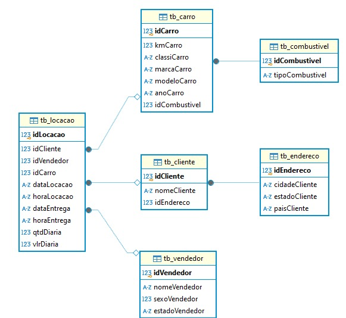

# Desafio 

## Etapa 1- Normalização dos dados
Comecei o desafio baixando o arquivo da concessionária e importando-o para o DBeaver, usando o SQLite. Em seguida, executei o comando abaixo para visualizar todas as tabelas e verificar se havia algum dado incorreto. Essa análise inicial foi essencial para que eu pudesse iniciar o processo do desafio.

Após analisar a tabela, identifiquei três colunas com dados inconsistentes. A primeira e a segunda era as colunas _dataLocacao_ e _dataEntrega_ onde as datas apareciam em um formato incomum, o que dificultava a leitura e organização. Decidi que, ao criar as tabelas, ajustaria essas datas para um formato mais adequado, garantindo consistência e padronização.

A terceira coluna com problemas era _horaLocacao_. Notei que os horários estavam misturados em dois formatos: horários iguais ou superiores a 10:00 estavam no formato HH:MM, enquanto horários menores que 10:00 apareciam como H:MM, sem o zero à esquerda. Para manter a uniformidade, planejei ajustar todos os horários para o formato HH:MM, adicionando o zero à esquerda em horários antes das 10:00.

Após identificar os dados inconsistentes, percebi que seria mais eficiente separar as tabelas para facilitar as consultas futuras. Por isso, organizei o nome de cada tabela e defini o conteúdo de cada uma, registrando tudo no Notion(imagem abaixo) para referência e organização.

##### Após concluir todas essas etapas, iniciei a criação da query. Agora, vou mostrar um pouco do que fiz.
Primeiro, removi tabelas que já existiam para evitar conflitos com a criação das novas tabelas, utilizando *DROP table if exists* em cada tabela que seria criada. A partir disso, criei as seguintes tabelas normalizadas:

* tb_combustivel: Contém as informações sobre os tipos de combustível, identificados por idCombustivel e tipoCombustivel.

* tb_carro: Armazena os detalhes dos carros, como quilometragem, classificação, marca, modelo, ano, e o tipo de combustível usado. A coluna idCombustivel é uma chave estrangeira referenciando tb_combustivel.

* tb_endereco: Armazena os dados de localização dos clientes, incluindo cidade, estado e país.

* tb_cliente: Contém nome dos clientes, com idCliente como chave primária e idEndereco como chave estrangeira, ligando-o à tabela tb_endereco.

* tb_vendedor: Armazena informações sobre os vendedores, incluindo nome, sexo e estado.

Após criar essas tabelas, realizei inserções de dados usando *INSERT INTO ... SELECT DISTINCT ... from tb_locacao* para transferir dados da tabela original (tb_locacao) para as tabelas recém-criadas, evitando duplicatas.

Em seguida, renomeei a tabela original tb_locacao para tb_locacao_nova e criei uma nova tabela tb_locacao, estruturando-a com chaves estrangeiras para associar clientes, vendedores e carros. 

Lembra que no início, eu identifiquei uma inconsistência nos dados da coluna horaLocacao, onde os horários estavam em diferentes formatos. Tentei ajustar o formato para HH:MM de várias maneiras, para que os horários menores que 10:00, tivessem o zero à esquerda. Apesar da ajuda dos meus colegas, não consegui resolver o problema. Sempre que eu tentava, o sistema exibia erro, ou os horários abaixo de 10:00 eram registrados como null. Por isso, decidi manter o formato original.

Consegui, no entanto, formatar as datas nas colunas dataLocacao e dataEntrega, que estavam em um padrão estranho. Ajustei-as para o formato YYYY-MM-DD, inserindo hifens para melhor legibilidade.

Finalmente, removi a tabela temporária tb_locacao_nova, mantendo apenas a estrutura normalizada.

Você pode ver o meu código no link abaixo: 
[normalização_dos_dados]()

E esse é o desenho da modelagem relacional após a normalização 

### Etapa 2- Modelagem Dimensional