# Desafio 

Iniciei o desafio instalando as bibliotecas necessárias. Para a __Pandas__, executei o seguinte comando no terminal: *pip install pandas*. Já para a __Matplotlib__, utilizei dois comandos: primeiro, para atualizar o gerenciador de pacotes, usei *python -m pip install -U pip*, e em seguida instalei a biblioteca com *python -m pip install -U matplotlib*.

Após instalar as bibliotecas, é necessário importá-las para poder utilizá-las no código. Por isso, iniciei meu código importando as bibliotecas, conforme mostrado na imagem abaixo.

Utilizei a função head() da biblioteca Pandas, que serve para visualizar as primeiras linhas de um DataFrame. Essa função foi muito útil para entender rapidamente a estrutura do arquivo e os dados presentes, incluindo os nomes das colunas, os tipos de dados e os valores iniciais, conforme mostrado na imagem abaixo.

Antes de iniciar o Código, li atentamente todo o desafio e anotei os gráficos que seriam necessários para concluí-lo. Em seguida, utilizei o comando *df['NomeColuna'].unique()* em todas as colunas que seriam utilizadas, para verificar se havia dados que precisavam ser tratados. Identifiquei que algumas colunas realmente exigem tratamento. Na imagem abaixo tem um exemplo de como é o comando.

__OBS:__ No código, optei por não incluir os comandos, pois achei que o código ficaria mais organizado sem eles.

A primeira coluna tratada foi a Installs, que continha um valor inadequado 'Free'. Esse valor pertence, na verdade, à tabela Type e não deveria estar presente na coluna Installs. Para corrigir isso, excluí a linha com o valor 'Free' do DataFrame, garantindo que os dados da coluna ficassem consistentes. Na imagem abaixo tem um exemplo de como é o comando.

__Sobre o código:__ O código cria uma máscara para identificar as linhas onde a coluna 'Installs' tem o valor 'Free' e exibe essas linhas usando *df.loc[mascara]*. Em seguida, remove a linha com o índice 10472 (que é o que esta o valor 'Free') do DataFrame usando *df.drop(10472)*.

A segunda coluna tratada foi a Rating. Nessa coluna, alguns valores estavam no formato 1. enquanto outros estavam no formato 1.6. Para uniformizar, acrescentei um 0 aos valores que estavam no formato 1., transformando-os em 1.0. Além disso, substituí os valores NaN por 0.0, garantindo que todos os dados estivessem completos e padronizados. A imagem abaixo mostra como tratei a coluna.

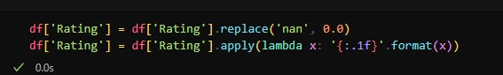

__Sobre o código:__ O código substitui valores 'nan' na coluna 'Rating' por 0.0 usando replace. Em seguida, formata todos os valores na coluna para uma string com uma casa decimal, utilizando o método apply com lambda e '{:.1f}'.format(x).

Ainda sobre a coluna Rating, criei uma função para limpar os valores da coluna Installs. Essa função removeu caracteres indesejados, como vírgulas e sinais de mais, e converteu os valores para o formato de número inteiro.

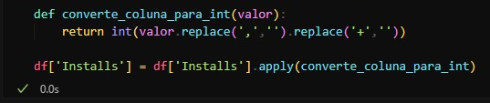

__Sobre o código:__ O código define a função converte_coluna_para_int, que remove vírgulas e sinais de adição (+) de um valor textual e o converte para um número inteiro. Em seguida, aplica essa função a cada elemento da coluna 'Installs' do DataFrame, transformando os valores de texto formatados (como '1,000+') em números inteiros limpos (como 1000).

Conforme solicitado nas instruções do desafio, removi as linhas duplicadas do DataFrame. Para isso, utilizei o método drop_duplicates(), passando no parâmetro subset a coluna 'App'. O parâmetro keep foi configurado para manter a primeira ocorrência de cada combinação, removendo as duplicatas subsequentes, conforme mostrado na imagem abaixo.

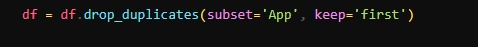

Agora, vou explicar como gerei os gráficos e realizei as análises, conforme solicitado no desafio.

A primeira tarefa solicitada foi criar um gráfico de barras mostrando os top 5 apps por número de instalações. Essa parte foi tranquila de realizar. Assisti a alguns vídeos externos para entender melhor a abordagem e, com isso, consegui implementar o gráfico sem maiores dificuldades. A imagem abaixo mostra como eu criei o gráfico e logo depois tem a imagem do gráfico pronto.

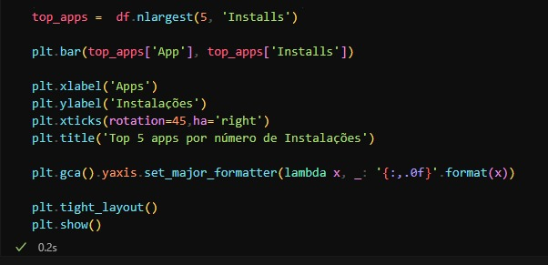

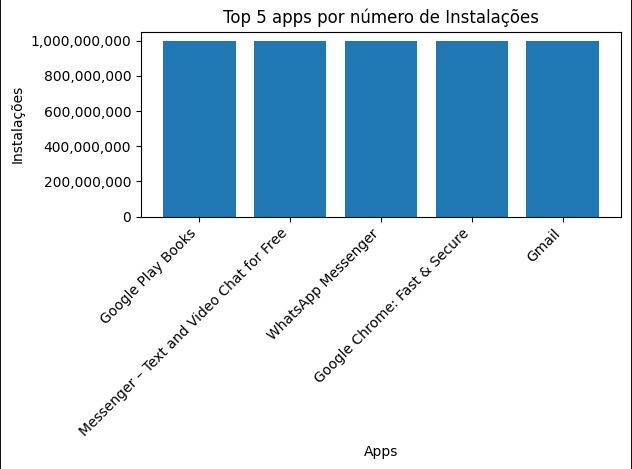

__Sobre o código:__ O código seleciona os 5 apps com o maior número de instalações do DataFrame usando a função *nlargest(5, 'Installs')*, e cria um gráfico de barras com esses apps no eixo X e o número de instalações no eixo Y. Em seguida, configura os rótulos do eixo X para girar 45 graus e ajusta o alinhamento para a direita *(ha='right')*. O título do gráfico é definido, e o formato das marcas do eixo Y é ajustado para exibir números com separação de milhares. Por fim, o layout do gráfico é ajustado para garantir que todos os elementos caibam corretamente na tela, e o gráfico é exibido com *plt.show()*.

A segunda tarefa foi criar um gráfico de pizza para mostrar as categorias de apps existentes no dataset, de acordo com a frequência com que elas aparecem. Essa parte foi um pouco mais desafiadora para mim, mas com alguma pesquisa consegui implementar o gráfico corretamente. No entanto, como o número de categorias era grande, o gráfico ficou difícil de ler e entender. Para melhorar a visualização, aumentei o tamanho do gráfico, o que facilitou a interpretação. A imagem abaixo mostra como eu criei o gráfico e logo depois tem a imagem do gráfico pronto (foi divida em 2, pois é muito grande e não consegui tirar um print só).

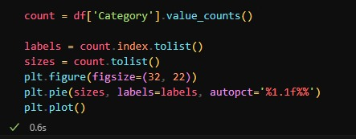

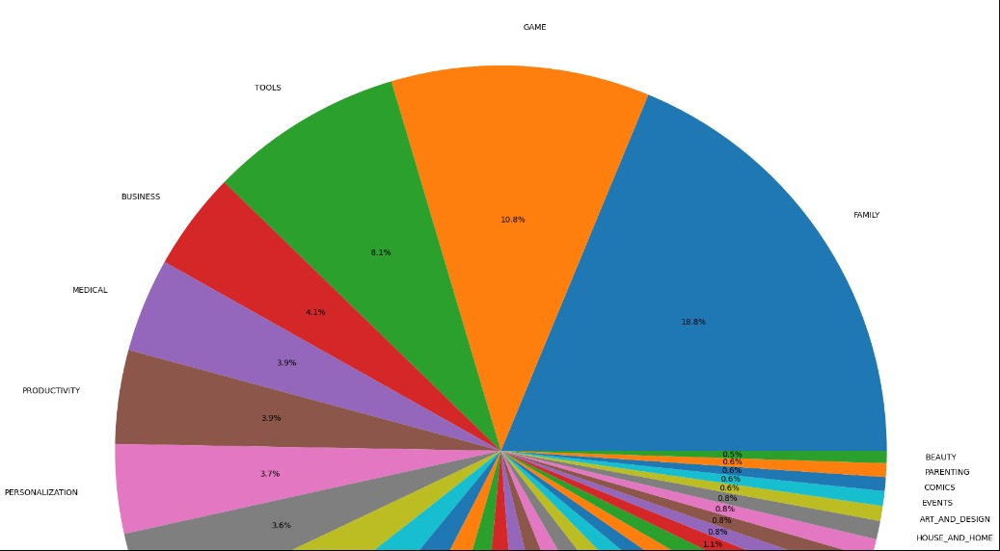
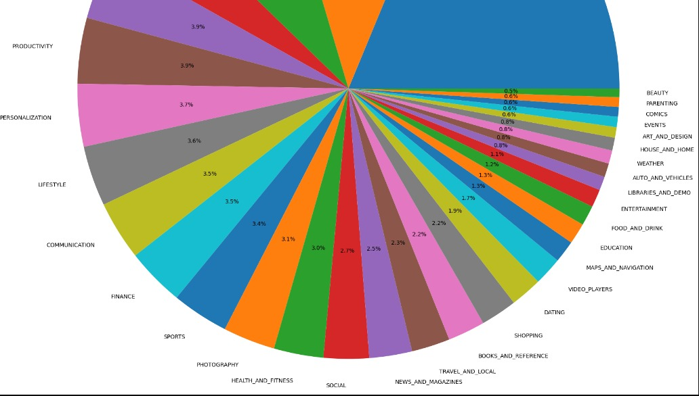

__Sobre o código:__ O código conta a quantidade de ocorrências de cada categoria na coluna 'Category' do DataFrame usando *value_counts()*. Em seguida, ele extrai as categorias (labels) e as quantidades correspondentes (sizes). A seguir, cria um gráfico de pizza utilizando *plt.pie()*, onde cada fatia representa a proporção de uma categoria, com os valores percentuais sendo exibidos no gráfico. Por fim, o gráfico é exibido com *plt.show()*, e a figura é configurada com um tamanho grande para visualização detalhada.

A terceira tarefa do desafio consistia em identificar qual era o aplicativo mais caro no conjunto de dados. Essa tarefa também foi tranquila de fazer. A imagem abaixo mostra como eu fiz a tarefa.

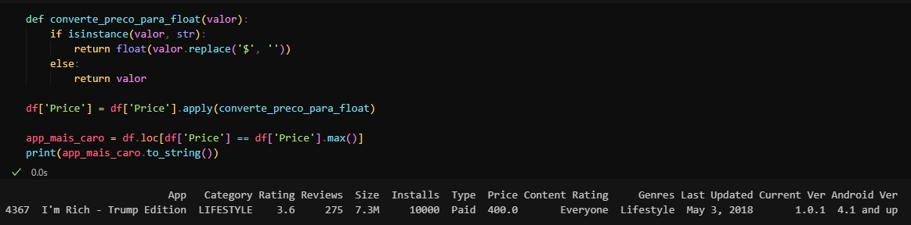

__Sobre o código:__ O código primeiro define a função converte_preco_para_float, que verifica se o valor é uma string, e, se for, remove o símbolo de dólar ($) e converte o valor para float; caso contrário, retorna o valor original. Depois, essa função é aplicada à coluna 'Price' do DataFrame para garantir que todos os preços sejam números float. Em seguida, o código encontra o app com o maior preço utilizando *df.loc[df['Price'] == df['Price'].max()]* e imprime os dados do app mais caro em formato de string.

A quarta tarefa foi identificar e exibir a quantidade de apps classificados como *'Mature 17+'*. Essa etapa foi bem tranquila de realizar e não apresentou dificuldades. A imagem abaixo mostra como eu fiz a tarefa.

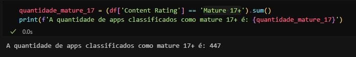

__Sobre o código:__ O código verifica quantos apps na coluna 'Content Rating' possuem a classificação 'Mature 17+'. Ele faz isso comparando cada valor dessa coluna com 'Mature 17+' (retornando uma série booleana) e, em seguida, utiliza o método *.sum()* para contar quantos valores são True. Por fim, imprime a quantidade total de apps com essa classificação em uma mensagem formatada.

A quinta tarefa foi exibir o top 10 apps com o maior número de reviews, juntamente com a quantidade respectiva de reviews, organizados em ordem decrescente. Inicialmente, meu código não estava funcionando como esperado. Após revisar, percebi que a coluna precisava ser convertida para o tipo numérico. Depois de realizar essa conversão, o código funcionou corretamente, e consegui obter o resultado desejado. A imagem abaixo mostra como eu fiz a tarefa.

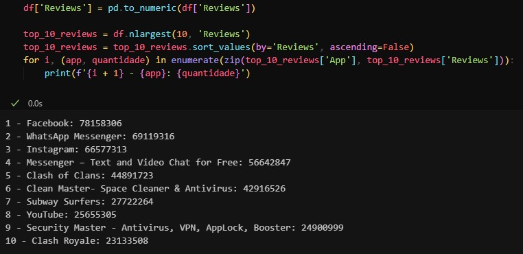

__Sobre o código:__ O código primeiro converte a coluna 'Reviews' para valores numéricos usando *pd.to_numeric* e seleciona os 10 apps com o maior número de reviews através de *nlargest(10, 'Reviews')*. Em seguida, ordena esses 10 apps em ordem decrescente de reviews com *sort_values(by='Reviews', ascending=False)* e, usando um loop, exibe cada app com sua posição no ranking e a quantidade de reviews.

A sexta tarefa era livre, então decidi realizar duas análises:

1. Média de Avaliação por Faixa Etária
Para isso, calculei a média das avaliações agrupadas pelas diferentes faixas etárias. Inicialmente, o código apresentou problemas, mas percebi que era necessário converter a coluna de avaliações para o tipo numérico. Após realizar a conversão, a análise funcionou perfeitamente, e consegui obter os resultados esperados. A imagem abaixo mostra como eu fiz o código.

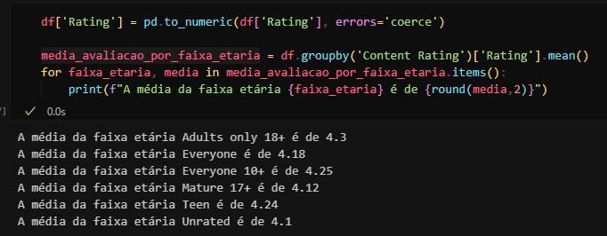

__Sobre o código:__ O código primeiro converte a coluna 'Rating' para valores numéricos, substituindo valores inválidos por NaN com *pd.to_numeric*. Em seguida, calcula a média dos ratings agrupados pela coluna 'Content Rating' (faixa etária), e para cada faixa etária, exibe uma mensagem indicando a média arredondada para duas casas decimais.

2. Top 10 Apps com Melhor Avaliação em Ordem Alfabética
Além disso, listei os top 10 apps com as melhores avaliações, ordenados alfabeticamente. Esse gráfico foi direto e não apresentou grandes dificuldades na implementação. A imagem abaixo mostra como eu fiz o código.

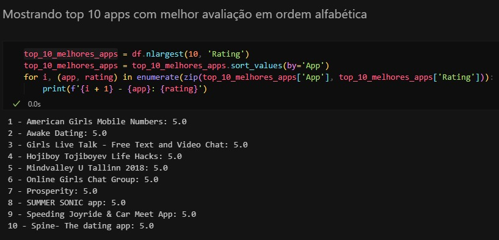

__Sobre o código:__ O código seleciona os 10 aplicativos com as maiores avaliações ('Rating') usando *nlargest* e os ordena em ordem alfabética com *sort_values(by='App')*. Em seguida, percorre os dados usando zip para combinar os nomes dos aplicativos ('App') e suas avaliações ('Rating'), exibindo no console o índice, o nome do aplicativo e sua avaliação.

A sétima tarefa também era livre, com a condição de incluir um gráfico. Escolhi representar graficamente as análises feitas na sexta tarefa:

1. Média de Avaliação por Faixa Etária
Para essa análise, optei por um gráfico de linha, que mostra de forma clara e contínua como as médias de avaliação variam entre as diferentes faixas etárias. Essa abordagem destacou as tendências e permitiu identificar faixas com avaliações mais altas ou mais baixas. A imagem abaixo mostra como eu fiz o código e logo depois tem a imagem do gráfico pronto.

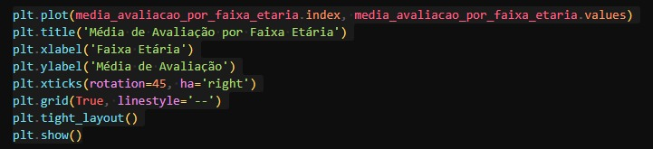

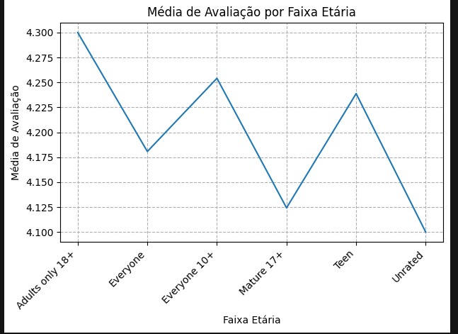

__Sobre o código:__ O código cria um gráfico de linha usando o matplotlib, onde o eixo X representa as faixas etárias e o eixo Y mostra a média de avaliações para cada faixa etária. O título do gráfico é "Média de Avaliação por Faixa Etária", e os rótulos dos eixos X e Y são definidos como "Faixa Etária" e "Média de Avaliação", respectivamente. A rotação dos rótulos no eixo X é ajustada para 45 graus, com alinhamento à direita. A grade do gráfico é ativada com um estilo de linha tracejada, e o layout é ajustado automaticamente para evitar sobreposição dos elementos. Por fim, o gráfico é exibido com o *plt.show()*.

2. Top 10 Apps com Melhor Avaliação em Ordem Alfabética
Para essa análise, utilizei um gráfico de dispersão, o que facilitou visualizar a relação entre os top 10 apps com melhor avaliação, agora ordenados alfabeticamente. Esse tipo de gráfico destacou bem as diferenças entre as avaliações, tornando os dados mais compreensíveis. A imagem abaixo mostra como eu fiz o código e logo depois tem a imagem do gráfico pronto.

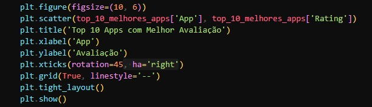

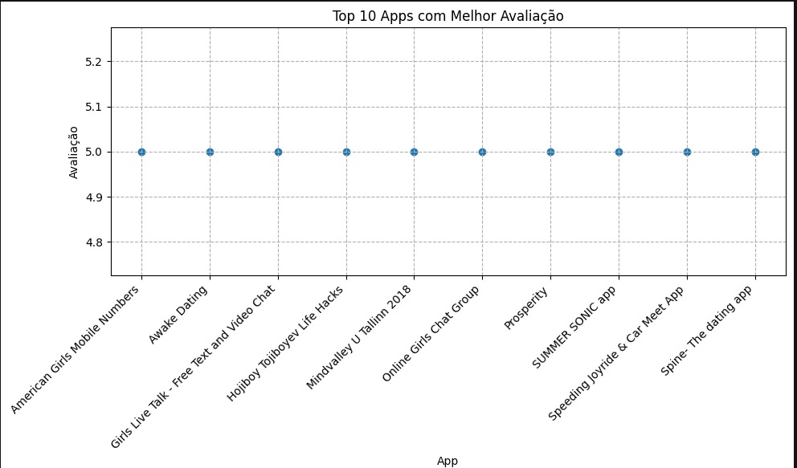

__Sobre o código:__ O código cria um gráfico de dispersão (scatter plot) usando Matplotlib para exibir os 10 apps com as melhores avaliações (Rating). O eixo x mostra os nomes dos apps e o eixo y representa suas avaliações. O gráfico é ajustado para ter uma largura de 10 unidades e altura de 6 unidades. Os rótulos no eixo x são rotacionados em 45 graus para melhor visualização, e a grade do gráfico é exibida com linhas tracejadas. O layout é ajustado para garantir que os rótulos não se sobreponham e o gráfico é exibido com *plt.show()*.

Após perceber que o gráfico de dispersão estava um pouco confuso para entender, decidi refazer a visualização utilizando um gráfico de barras horizontal. A imagem abaixo mostra como eu fiz o código e logo depois tem a imagem do gráfico pronto.

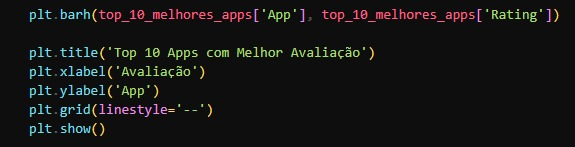

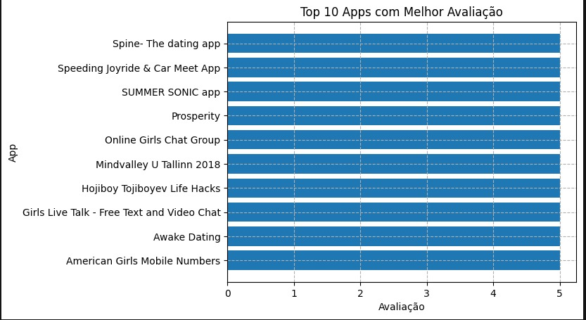

__Sobre o código:__ O código cria um gráfico de barras horizontal (com barh) usando a biblioteca matplotlib, exibindo os 10 apps com as melhores avaliações (baseado na coluna 'Rating'). A barra horizontal representa as avaliações dos apps (no eixo X), enquanto o nome dos apps é mostrado no eixo Y. O título do gráfico é "Top 10 Apps com Melhor Avaliação", com rótulos para os eixos X e Y, e uma linha de grade no fundo para melhorar a visualização. Ao final, o gráfico é exibido com o *plt.show()*.