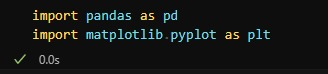

# Desafio 

Iniciei o desafio instalando as bibliotecas necessárias. Para a __Pandas__, executei o seguinte comando no terminal: *pip install pandas*. Já para a __Matplotlib__, utilizei dois comandos: primeiro, para atualizar o gerenciador de pacotes, usei *python -m pip install -U pip*, e em seguida instalei a biblioteca com *python -m pip install -U matplotlib*.

Após instalar as bibliotecas, é necessário importá-las para poder utilizá-las no código. Por isso, iniciei meu código importando as bibliotecas, conforme mostrado na imagem abaixo.

Utilizei a função head() da biblioteca Pandas, que serve para visualizar as primeiras linhas de um DataFrame. Essa função foi muito útil para entender rapidamente a estrutura do arquivo e os dados presentes, incluindo os nomes das colunas, os tipos de dados e os valores iniciais, conforme mostrado na imagem abaixo.

Antes de iniciar o Código, li atentamente todo o desafio e anotei os gráficos que seriam necessários para concluí-lo. Em seguida, utilizei o comando *df['NomeColuna'].unique()* em todas as colunas que seriam utilizadas, para verificar se havia dados que precisavam ser tratados. Identifiquei que algumas colunas realmente exigem tratamento. Na imagem abaixo tem um exemplo de como é o comando.

Observação: No código, incluí o comando de verificação *df['NomeColuna'].unique()* seguido imediatamente pelo tratamento da coluna. No entanto, na prática, executei todos os comandos de verificação antes e só depois iniciei os ajustes. Optei por organizá-los dessa forma no código para mantê-lo mais estruturado e fácil de entender.

A primeira coluna tratada foi a Installs, que continha um valor inadequado: 'Free'. Esse valor pertence, na verdade, à tabela Type e não deveria estar presente na coluna Installs. Para corrigir isso, excluí a linha com o valor 'Free' do DataFrame, garantindo que os dados da coluna ficassem consistentes. Na imagem abaixo tem um exemplo de como é o comando.

Conforme solicitado nas instruções do desafio, removi as linhas duplicadas do DataFrame. Para isso, utilizei o método drop_duplicates(), passando no parâmetro subset uma lista com as colunas 'App' e 'Last Update'. Dessa forma, o DataFrame eliminou as duplicatas considerando apenas as combinações dessas duas colunas. O parâmetro keep foi configurado para manter a primeira ocorrência de cada combinação, removendo as duplicatas subsequentes, conforme mostrado na imagem abaixo.

