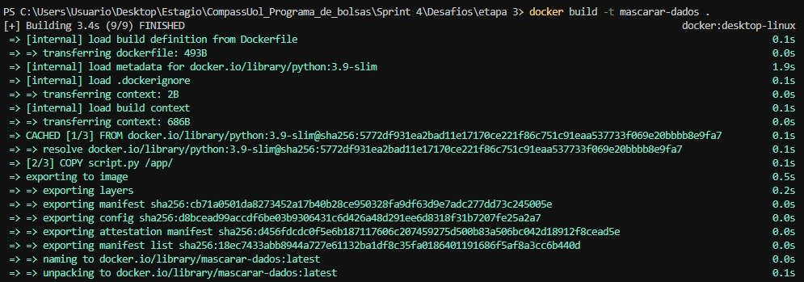
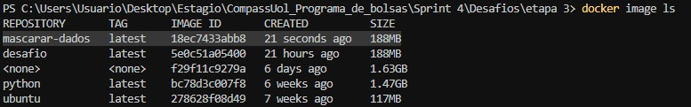
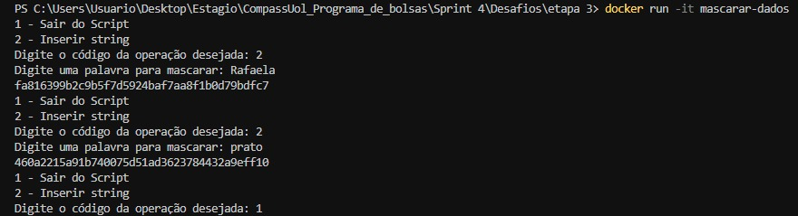
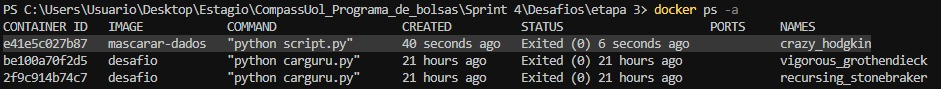

# Desafio 

Iniciei o desafio realizando o download do arquivo carguru.py. Após isso, o desafio foi dividido em etapas.

## __PRIMEIRA ETAPA__:
O primeiro passo dessa etapa foi criar um arquivo chamado __Dockerfile__. Esse arquivo é responsável por definir a imagem base, copiar o arquivo carguru.py para o ambiente do container e configurá-lo para ser executado automaticamente assim que o container for iniciado.

No arquivo Dockerfile, construí uma imagem configurada para executar o código presente no arquivo carguru.py.  Segue abaixo um print que mostra a imagem que eu criei:

__Explicação:__ 
* No FROM eu usei a imagem base do Python 3.9 com a versão slim que é mais leve, para conseguir reduzir o tamanho da imagem. Após pesquisar, concluí que essa versão era a mais eficiente para o meu objetivo de deixar o mais leve possível.
* No COPY ele copia o arquivo carguru.py do meu diretório local para o diretório /app/ do container.
* No WORKDIR ele define o diretório de trabalho dentro do container como /app/. 
* No CMD ele configura o comando para executar o arquivo carguru.py usando o Python quando iniciar o container. 

Antes de começar a executar os comandos necessários, abri o Docker Desktop, já que, se tentar executar qualquer comando Docker sem que ele esteja inicializado, ocorre um erro. 

Para executar os comandos Docker, cliquei com o botão direito do mouse sobre o diretório onde estão o arquivo Dockerfile e o carguru.py. Isso garantiu que os comandos fossem executados no local correto, evitando erros relacionados ao caminho do arquivo.

Para criar a imagem Docker, utilizei o seguinte comando:

* -t desafio: Define uma "tag" (nome) para a imagem criada. No caso, eu nomeei a imagem como desafio.
* .: O ponto indica o caminho onde o arquivo Dockerfile está localizado.

Após criar a imagem, usei o comando abaixo para verificar se a imagem foi criada corretamente:

Esse comando lista todas as imagens Docker disponíveis no meu sistema, permitindo confirmar que a imagem desafio foi criada com sucesso e está presente.

Depois de confirmar que a imagem desafio foi criada com sucesso, utilizei o comando:

Esse comando cria e executa um container com base na imagem desafio.
A saída foi exatamente como esperado: "Você deve dirigir um [nome de um carro da lista do carguru.py]"
Isso confirmou que a imagem e o container foram configurados corretamente.

Após criar o container, usei o comando abaixo:

Esse comando lista todos os containers criados, incluindo os que estão em execução e os que já foram finalizados. Esse comando foi útil para verificar se o container da imagem desafio foi criado e executado corretamente.

## __SEGUNDA ETAPA__:

Na segunda etapa, o objetivo era responder à pergunta: __"É possível reutilizar containers? Em caso positivo, apresente o comando necessário para reiniciar um dos containers parados em seu ambiente Docker? Não sendo possível reutilizar, justifique sua resposta."__

Segue abaixo o print com a minha resposta.

## __TERCEIRA ETAPA__:

Iniciei a etapa 3 criando uma pasta chamada etapa 3. Dentro dessa pasta, adicionei dois arquivos: um chamado script.py e outro chamado Dockerfile.

No arquivo script.py, desenvolvi o script solicitado, implementando as funcionalidades conforme os requisitos da etapa. Segue abaixo a imagem que ilustra o código desenvolvido.

__Explicação:__ 
* eu fiz um menu simples onde o usuário pode escolher entre sair do script (1) ou inserir uma string para mascarar (2).
* Se o usuário escolhe 2, o programa solicita uma string, converte-a para um formato de bytes (necessário para hashing) e gera seu valor hash usando o algoritmo SHA-1, exibindo o resultado na tela.
    *  *hash = hashlib.sha1(string.encode())* : Cria um objeto hash usando o algoritmo SHA-1 e converte a string para bytes antes de processar
    *  *print(hash.hexdigest())* : Exibe o valor hash (em hexadecimal) gerado a partir da string fornecida
* Caso o usuário escolha 1, o programa finaliza o loop e encerra a execução.
* Se o usuário insere qualquer valor que não seja 1 ou 2, uma mensagem de erro é exibida, e o menu é mostrado novamente.

No arquivo Dockerfile, configurei a imagem para executar o script.py. Aqui está o print mostrando a configuração utilizada e a imagem criada para essa etapa.

__Explicação:__ 
* No FROM eu usei a imagem base do Python 3.9 com a versão slim que é mais leve, para conseguir reduzir o tamanho da imagem. Após pesquisar, concluí que essa versão era a mais eficiente para o meu objetivo de deixar o mais leve possível.
* No COPY ele copia o arquivo script.py do meu diretório local para o diretório /app/ do container.
* No WORKDIR ele define o diretório de trabalho dentro do container como /app/. 
* No CMD ele configura o comando para executar o arquivo script.py usando o Python quando iniciar o container. 

Antes de começar a executar os comandos necessários, abri o Docker Desktop, já que, se tentar executar qualquer comando Docker sem que ele esteja inicializado, ocorre um erro. 

Para executar os comandos Docker, cliquei com o botão direito do mouse sobre o diretório onde estão o arquivo Dockerfile e o script.py que no caso é o __etapa 3__. Isso garantiu que os comandos fossem executados no local correto, evitando erros relacionados ao caminho do arquivo.

Para criar a imagem Docker, utilizei o seguinte comando:

* -t desafio: Define uma "tag" (nome) para a imagem criada. No caso, eu nomeei a imagem como mascarar-dados.
* .: O ponto indica o caminho onde o arquivo Dockerfile está localizado.

Após criar a imagem, usei o comando abaixo para verificar se a imagem foi criada corretamente:

Esse comando lista todas as imagens Docker disponíveis no meu sistema, permitindo confirmar que a imagem mascarar-dados foi criada com sucesso e está presente.

Depois de confirmar que a imagem mascarar-dados foi criada com sucesso, utilizei o comando:

Esse comando cria e executa um container com base na imagem mascarar-dados.
* -it: Permite uma interatividade com o container.

Eu testei o script para garantir que estava funcionando corretamente. Durante o teste, segui os passos abaixo:

1. Digitei o número 2 para entrar na funcionalidade de mascarar palavras.
2. Em seguida, inseri as palavras __Rafaela__ (meu nome) e __prato__ para serem mascaradas.
3. Finalizei o programa digitando o número 1 para sair.
Tudo funcionou conforme o esperado, com as palavras sendo mascaradas corretamente e o programa encerrando sem erros.

Após criar o container, usei o comando abaixo:

Esse comando lista todos os containers criados, incluindo os que estão em execução e os que já foram finalizados. Esse comando foi útil para verificar se o container da imagem desafio foi criado e executado corretamente.

__OBSERVAÇÃO__: As pastas mostradas nos prints estão diferentes das pastas atuais porque reorganizei as etapas após concluir os desafios. Por isso, há essa divergência entre as imagens e a estrutura final.