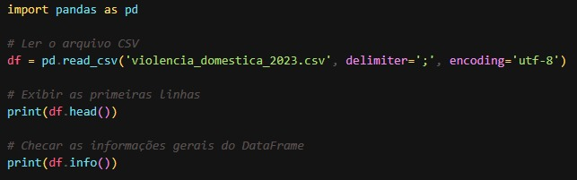

# Desafio 

Iniciei o desafio escolhendo um dataset conforme as orientações fornecidas na Udemy. Após pesquisar no site do governo, encontrei um dataset que contém dados sobre Violência contra a Mulher no estado de Minas Gerais.
Por coincidência, apareceu para mim no LinkedIn um post de uma lista de datasets recomendados para criar o primeiro portfólio, e esse dataset estava nessa lista. Então, acabei escolhendo ele.

[Aqui está o link para o site do dataset](https://dados.gov.br/dados/conjuntos-dados/violencia-contra-mulher)

Agora vou explicar um pouco sobre o dataset e o que cada coluna representa:

* municipio_cod: código do município.
* municipio_fato: nome do município onde ocorreu o fato.
* data_fato: data em que o fato ocorreu.
* mes: mês em que o fato ocorreu.
* ano: ano em que o fato ocorreu.
* risp: nome do departamento onde o caso foi registrado.
* rmbh: indica se o fato ocorreu na capital de MG ou no interior.
* natureza_delito: descrição do que ocorreu no incidente.
* tentado_consumado: indica se o fato foi consumado ou tentado.
* qtde_vitimas: quantidade de vítimas no fato.

Depois, comecei de fato o desafio criando um arquivo chamado entendendo_dataset.py, onde utilizei a biblioteca pandas para analisar melhor o dataset.

[link para o arquivo](../Desafios/entendendo_dataset.py)

Após analisar melhor o dataset, encontrei algumas datas incorretas, conforme mostrado na imagem abaixo.

Inicialmente, tentei resolver o problema usando Python, mas, ao executar o código, não funcionava como esperado. Então, optei por corrigir diretamente no Excel, o que, por algum motivo, deu certo.

Segui os seguintes passos:

1. Selecionei todas as linhas da coluna data_fato.
2. Cliquei com o botão direito do mouse.
3. Escolhi a opção Formatar Células.
4. Selecionei o formato Data.
5. Confirmei clicando em OK.
6. Salvei o dataset.
Após realizar esses ajustes, tudo funcionou corretamente como eu esperava.

Primeiro, tentei cadastrar minhas credenciais da AWS utilizando o comando *aws configure*. No entanto, enfrentei problemas, e nenhuma tentativa funcionava. O erro que aparecia era:

"An error occurred (InvalidAccessKeyId) when calling the ListBuckets operation: The AWS Access Key Id you provided does not exist in our records."

Diante disso, decidi incluir as credenciais diretamente no script para prosseguir.

Para testar se as credenciais estavam funcionando corretamente, criei um código simples com o objetivo de criar o bucket necessário para o desafio.

Aqui está um vídeo mostrando a execução do script, junto com uma imagem do código e também o link para acessá-lo.
__Importante__: Para testar o script, é necessário adicionar as credenciais da AWS. No entanto, elas foram removidas do arquivo por questões de segurança.

[Link para o script que cria o bucket](../Desafios/criar_bucket.py)

Em seguida, criei um script para fazer o upload do meu dataset para o bucket que criei, conforme solicitado nas instruções do desafio.

Aqui está um vídeo mostrando a execução do script, junto com uma imagem do código e também o link para acessá-lo.

__Importante__: Para testar o script, é necessário adicionar as credenciais da AWS. No entanto, elas foram removidas do arquivo por questões de segurança.

[Link para o script que faz upload do dataset](../Desafios/script_boto.py)

Depois, criei um arquivo chamado dataframe.py, que carrega o arquivo armazenado no S3 e realiza todas as manipulações solicitadas nas orientações, utilizando a biblioteca pandas.
 As instruções pediam:

* Uma cláusula que filtra dados usando ao menos dois operadores lógicos.
* Duas funções de agregação.
* Uma função condicional.
* Uma função de conversão.
* Uma função de data.
* Uma função de string.

Antes de começar as manipulações, elaborei uma pergunta para orientar a análise e responder a ela utilizando as transformações no dataset. Embora algumas manipulações não sejam diretamente relacionadas à pergunta, elas foram feitas para atender aos requisitos do desafio.

__A pergunta é:__
"Quais são as 5 maiores médias de vítimas por município no interior de MG, considerando apenas delitos consumados, durante o ano de 2023?"

Esse arquivo realiza todas as transformações necessárias no dataset, imprime a resposta final da análise e salva o dataframe transformado localmente. Além disso, ele faz o upload do arquivo transformado para o S3.

Aqui está um vídeo mostrando a execução do script, junto com o link para acessá-lo.

__Importante__: Para testar o script, é necessário adicionar as credenciais da AWS. No entanto, elas foram removidas do arquivo por questões de segurança.

[link para o arquivo](../Desafios/dataframe2.py)

A análise das 5 maiores médias de vítimas por município no interior de MG, considerando delitos consumados em 2023, pode identificar regiões com alta incidência de crimes. Isso permite direcionar recursos de segurança pública, propor políticas preventivas, como reforço no policiamento e ações sociais, e engajar a comunidade em iniciativas de redução da violência. 
