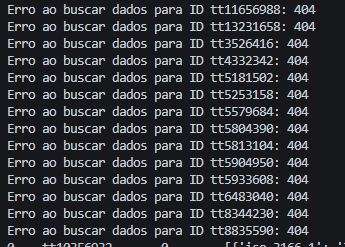

# Desafio 

# Perguntas

Fiz uma pequena alteração na ordem das minhas perguntas. Primeiro, vou explorar a seguinte questão:

* Qual foi o ano em que mais filmes de Drama/Romance foram lançados?

A partir dela, pretendo expandir a análise com outras perguntas, como:

1. Quais são os 10 filmes mais bem avaliados no gênero Drama/Romance?
2. Quais artistas têm mais personagens associados a filmes desse gênero?
3. Quais são os 10 atores que mais participaram de filmes de Drama/Romance?
4. Quais são os 3 filmes mais votados no gênero Drama/Romance?
5. Qual é a média de idade dos atores que atuam em filmes de Drama/Romance?
6. Quais países mais produzem filmes de Drama/Romance?
7. Existe alguma correlação entre o país de origem e a popularidade (nota média ou número de votos)?

# 
A primeira coisa que fiz foi criar um arquivo .ipynb que filtra os IDs do arquivo movies.csv. Fiz isso para obter do TMDB apenas os filmes lançados no ano em que mais filmes foram produzidos e que pertencem exatamente ao gênero 'Drama,Romance', como está escrito.

[filtrando_filmes.ipynb](./etapa1/filtrando_filmes.ipynb)

Esse processo gerou dois arquivos:

[filtro_generos.csv](./etapa1/filtrogeneros.csv)

[ids_generos.txt](./etapa1/ids_generos.txt)

Um CSV contendo esses filmes (possui filmes repetidos devido a personagens e atores duplicados).
Um arquivo TXT com os IDs desses filmes, mas sem repetições.

Depois disso, desenvolvi o código para ser usado no AWS Lambda.

[script_lambda.py](./script_lambda.py)

Decidi pegar as seguintes colunas do TMDB para complementar minha análise:

* budget
* production_countries
* popularity
* origin_country
* original_language.

Depois de criar o script para o Lambda, decidi testá-lo localmente antes. Para isso, criei um arquivo de teste.

[teste.py](./etapa1/teste.py)

Ao rodar o arquivo, percebi que alguns IDs não existiam na API. Então, excluí esses IDs da lista e rodei o teste novamente. Dessa vez, deu tudo certo.

Após isso, atualizei a lista de IDs no script que será usado no Lambda.

Na parte da AWS, a primeira coisa que fiz foi criar uma função dentro do Lambda chamada __ConsomeApiTMDB__.

