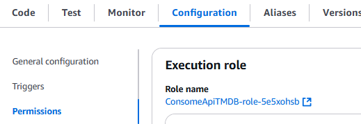

# Desafio 

# Perguntas

Fiz uma pequena alteração na ordem das minhas perguntas. Primeiro, vou explorar a seguinte questão:

* Qual foi o ano em que mais filmes de Drama/Romance foram lançados?

A partir dela, pretendo expandir a análise com outras perguntas, como:

1. Quais são os 10 filmes mais bem avaliados no gênero Drama/Romance?
2. Quais artistas têm mais personagens associados a filmes desse gênero?
3. Quais são os 10 atores que mais participaram de filmes de Drama/Romance?
4. Quais são os 3 filmes mais votados no gênero Drama/Romance?
5. Qual é a média de idade dos atores que atuam em filmes de Drama/Romance?
6. Quais países mais produzem filmes de Drama/Romance?
7. Existe alguma correlação entre o país de origem e a popularidade (nota média ou número de votos)?

# 
A primeira coisa que fiz foi criar um arquivo .ipynb que filtra os IDs do arquivo movies.csv. Fiz isso para obter do TMDB apenas os filmes lançados no ano em que mais filmes foram produzidos e que pertencem exatamente ao gênero 'Drama,Romance', como está escrito.

[filtrando_filmes.ipynb](./etapa1/filtrando_filmes.ipynb)

Esse processo gerou dois arquivos:

[filtro_generos.csv](./etapa1/filtro_generos.csv)

[ids_generos.txt](./etapa1/ids_generos.txt)

Um CSV contendo esses filmes (possui filmes repetidos devido a personagens e atores duplicados).
Um arquivo TXT com os IDs desses filmes, mas sem repetições.

Depois disso, desenvolvi o código para ser usado no AWS Lambda.

[script_lambda.py](./script_lambda.py)

Decidi pegar as seguintes colunas do TMDB para complementar minha análise:

* budget
* production_countries
* popularity
* origin_country
* original_language.
* imdb_id

Depois de criar o script para o Lambda, decidi testá-lo localmente antes. Para isso, criei um arquivo de teste.

[teste.py](./etapa1/teste.py)

Ao rodar o arquivo, percebi que alguns IDs não existiam na API. Então, excluí esses IDs da lista e rodei o teste novamente. Dessa vez, deu tudo certo.

Após isso, atualizei a lista de IDs no script que será usado no Lambda.

Na parte da AWS, a primeira coisa que fiz foi criar uma função dentro do Lambda chamada __ConsomeApiTMDB__.

Após isso, colei o código que fiz dentro do code source. O código é este abaixo:

[script_lambda.py](./script_lambda.py)

Em seguida, substituí a variável chave_api pela minha chave que obtive na API TMDB.

Depois, cliquei em Deploy para que a alteração do código fosse realizada.

Para baixar as dependências, precisei criar um arquivo Dockerfile:

[Dockerfile](./Dockerfile)

Então, rodei os seguintes comandos:

Este comando cria uma imagem:

Este comando executa o container. Dentro do bash, ele cria os diretórios necessários e instala as dependências no diretório python:

Por fim, executei o comando __zip -r minha-camada-pandas.zip .__, mas acabei esquecendo de tirar um print.

Depois, abri outro terminal e executei os dois comandos abaixo:

Este comando lista todos os containers, então copiei o ID do container que estava rodando:

Finalmente, este comando compacta todos os arquivos em um arquivo chamado minha-camada-pandas.zip:

[minha-camada-pandas.zip](./minha-camada-pandas.zip)

Depois disso, fiz o upload do arquivo minha-camada-pandas.zip para o meu bucket.

Em seguida, voltando para o Lambda, criei uma layer chamada LayerAPI. No campo de Link do URL do Amazon S3, inseri o Object URL que copiei do arquivo no bucket.

Ainda no Lambda, fui na seção de funções e, dentro da aba *Code*, desci até a área de Layers. Cliquei em *Add a layer* e adicionei a layer que eu havia criado anteriormente.

Depois, fui até a aba Configuration, cliquei em Permissions e, em seguida, no Role name.

Isso abriu outra página, onde cliquei em Add permissions e depois em Attach policies. Busquei por AmazonS3FullAccess e selecionei essa permissão.

Por fim, voltei ao Lambda, cliquei em Test para executar a função, e ela rodou corretamente.

E para comprovar que as pastas foram criadas corretamente no bucket, tirei o print abaixo:

E aqui estão os três arquivos que foram criados com os JSONs:

[arquivo-1.json](./JSONS/arquivo-1.json)

[arquivo-2.json](./JSONS/arquivo-2.json)

[arquivo-3.json](./JSONS/arquivo-3.json)
