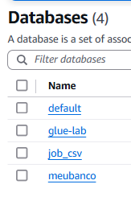
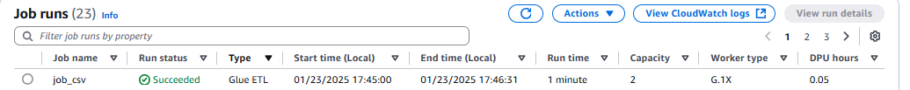
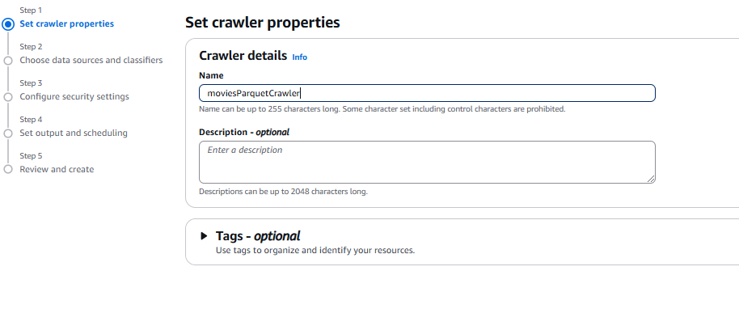
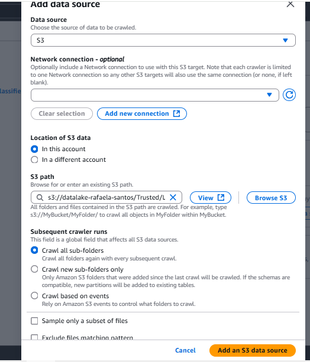
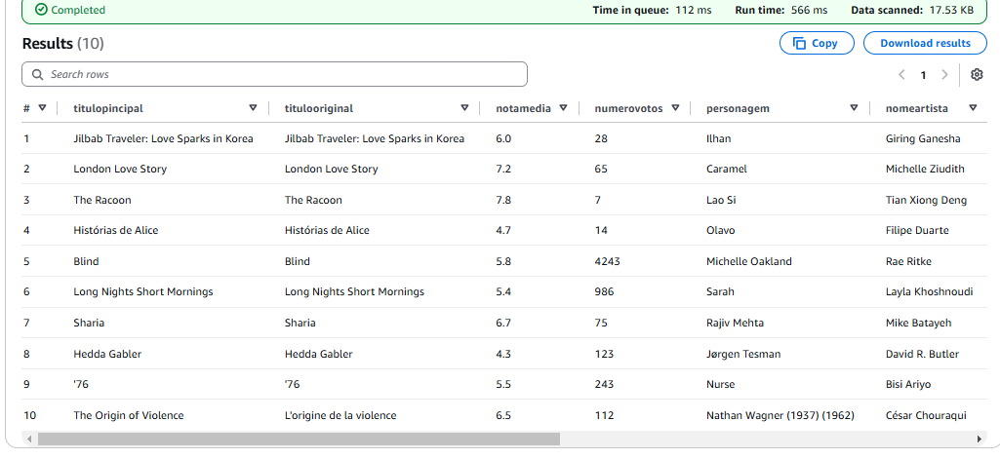
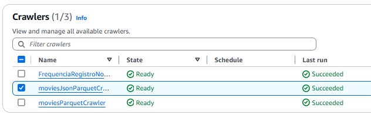

# Desafio 

# Perguntas

Primeiro, vou explorar a seguinte questão:

* Qual foi o ano em que mais filmes de Drama/Romance foram lançados?

A partir dela, pretendo expandir a análise com outras perguntas, como:

Incluí mais algumas possíveis perguntas na minha análise.

1. Quais são os 10 filmes mais bem avaliados no gênero Drama/Romance?
2. Quais artistas têm mais personagens associados a filmes desse gênero?
3. Quais são os 10 atores que mais participaram de filmes de Drama/Romance?
4. Quais são os 3 filmes mais votados no gênero Drama/Romance?
5. Qual é a média de idade dos atores que atuam em filmes de Drama/Romance?
6. Quais países mais produzem filmes de Drama/Romance?
7. Existe alguma correlação entre o país de origem e a popularidade (nota média ou número de votos)?

Vou detalhar um pouco mais sobre as minhas questões.
1. Essa análise ajuda a identificar características específicas, como direção, enredo e elenco, que fazem um filme ser altamente avaliado. Também pode revelar tendências no gênero, como preferências por épocas ou diretores.

2. Permite identificar atores/atrizes especializados ou muito requisitados no gênero, além de evidenciar quais artistas são populares ou influentes em dramas e romances. Também pode revelar a versatilidade dos atores nesse tipo de produção.

3. Destaca profissionais com carreiras prolíficas no gênero, ajudando a compreender a preferência da indústria cinematográfica por certos artistas e sua relevância nesse contexto.

4. Revela quais filmes tiveram maior popularidade ou impacto, indicando uma possível correlação entre marketing, distribuição e o interesse do público.

5. Ajuda a identificar o perfil demográfico predominante dos atores no gênero e mostra se existe uma faixa etária mais favorecida para papéis nesse tipo de produção.

6. Identifica os líderes globais na produção do gênero, evidenciando a contribuição cultural e regional para dramas e romances.

7. Revela possíveis vieses regionais na avaliação ou consumo de filmes, ajudando a entender como o público responde a produções com base no país de origem.

8. Mostra o padrão típico de duração para o gênero, ajudando na criação de produções que atendam às expectativas do público.

9. Destaca países reconhecidos pela qualidade de suas produções, seja por direção, roteiro ou outros fatores, ajudando a entender a percepção global de excelência no gênero.

#
Eu tentei criar um código que fosse capaz de criar as pastas e, em seguida, salvar o arquivo .parquet diretamente no bucket, mas não consegui implementar da maneira que desejava.

Por isso, criei dois scripts separado para criar as pastas necessárias utilizando a biblioteca boto3.

Segue o script que cria as pastas pro CSV que desenvolvi:
[cria_pastas_csv.py](./cria_pastas_csv.py)

Após rodar o script, obtive o seguinte resultado:

Segue o script que cria as pastas pro JSON que desenvolvi:
[cria_pastas_json.py](./cria_pastas_json.py)

Após rodar o script, obtive o seguinte resultado:

__OBS:__ *Lembrando que, para testar o código, é necessário substituir as credenciais, mas eu não coloquei as minhas aqui por questões de segurança.*

### JOB CSV
A primeira coisa que fiz foi escrever o script pro job csv que foi solicitados nas instruções do desafio.

O script que escrevi para o job do CSV é o seguinte:

[job_csv.py](./job_csv.py)

Fiz essa filtragem para garantir que os filmes ficassem iguais aos filmes que puxei do TMDB na sprint passada.

__RESUMO DO CÓDIGO:__ O meu código processa um arquivo CSV localizado no S3. Ele lê os dados, filtra os filmes com base em uma lista de IDs do IMDb que eu peguei da sprint 7 e seleciona apenas as colunas necessárias para a minha análise. Após realizar o filtro e seleção das colunas, o DataFrame resultante é salvo no formato Parquet. 

__EXECUÇÃO:__
Primeiro, utilizei o AWS Lake Formation para criar o banco de dados onde o crawler futuramente adicionará automaticamente uma tabela a partir dos dados armazenados no S3.

Depois disso, criei um novo job para processar o meu script CSV. Para isso, segui as recomendações fornecidas nas instruções do desafio.

Aqui utilizei o mesmo IAM Role que foi criado no exercício de Glue da Sprint 7

Após configurar o job, cliquei em Save.

Por fim, inseri o código no Glue e cliquei em Run para executar o job.

Fui até o Job Run Monitoring e acompanhei a execução.

Depois, fui até o S3 para verificar se o processo havia sido executado corretamente e se os arquivos estavam no caminho esperado.

Depois de concluir essas etapas, criei o Crawler para gerar uma tabela a partir dos dados armazenados no S3.

Aqui utilizei o mesmo IAM Role que foi criado no exercício de Glue da Sprint 7.

Em seguida, selecionei o Crawler que havia criado e cliquei em Run para executá-lo.

Após a execução, cliquei em Table, depois em Table Data e depois em Proceed, o que abriu o Athena com o comando SQL já gerado para realizar um SELECT.

Eu cliquei em Run again para confirmar se estava tudo correto, e esse foi o resultado obtido:

### JOB JSON
A primeira coisa que fiz foi escrever o script pro job json que foi solicitados nas instruções do desafio.

O script que escrevi para o job JSON é o seguinte:

[job_csv.py](./job_json.py)

__RESUMO DO CÓDIGO:__ O meu código processa meus arquivos JSONs localizado no S3. Ele lê os arquivos JSONs armazenado no S3, convertendo os dados para um DataFrame. Em seguida, esses dados são gravados no formato Parquet em outro diretório do S3.
Eu não apliquei nenhum filtro, pois na sprint 7 já tinha realizado a filtragem dos filmes e das colunas que eu precisava.

__EXECUÇÃO:__
Primeiro, utilizei o AWS Lake Formation para criar o banco de dados onde o crawler futuramente adicionará automaticamente uma tabela a partir dos dados armazenados no S3.

Depois disso, criei um novo job para processar o meu script CSV. Para isso, segui as recomendações fornecidas nas instruções do desafio.

Aqui utilizei o mesmo IAM Role que foi criado no exercício de Glue da Sprint 7.

Após configurar o job, cliquei em Save.

Inseri o código no Glue e cliquei em Run para executar o job.

Fui até o Job Run Monitoring e acompanhei a execução.

Depois, fui até o S3 para verificar se o processo havia sido executado corretamente e se os arquivos estavam no caminho esperado.

Depois de concluir essas etapas, criei o Crawler para gerar uma tabela a partir dos dados armazenados no S3.

Aqui utilizei o mesmo IAM Role que foi criado no exercício de Glue da Sprint 7.

Em seguida, selecionei o Crawler que havia criado e cliquei em Run para executá-lo.

Após a execução, cliquei em Table, depois em Table Data e depois em Proceed, o que abriu o Athena com o comando SQL já gerado para realizar um SELECT.

Eu cliquei em Run again para confirmar se estava tudo correto, e esse foi o resultado obtido:

