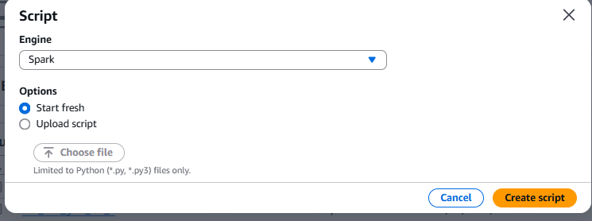

# Desafio 

# Perguntas

Primeiro, vou explorar a seguinte questão:

* Qual foi o ano em que mais filmes de Drama/Romance foram lançados?
Incluí mais algumas possíveis perguntas na minha análise.
A partir dela, pretendo expandir a análise com outras perguntas, como:

1. Quais são os 10 filmes mais bem avaliados no gênero Drama/Romance?
2. Quais artistas têm mais personagens associados a filmes desse gênero?
3. Quais são os 10 atores que mais participaram de filmes de Drama/Romance?
4. Quais são os 3 filmes mais votados no gênero Drama/Romance?
5. Qual é a média de idade dos atores que atuam em filmes de Drama/Romance?
6. Quais países mais produzem filmes de Drama/Romance?
7. Existe alguma correlação entre o país de origem e a popularidade (nota média ou número de votos)?

Vou detalhar um pouco mais sobre as minhas questões.
1. 
Essa análise ajuda a identificar características específicas, como direção, enredo e elenco, que fazem um filme ser altamente avaliado. Também pode revelar tendências no gênero, como preferências por temas, épocas ou diretores.

2. 
Permite identificar atores/atrizes especializados ou muito requisitados no gênero, além de evidenciar quais artistas são populares ou influentes em dramas e romances. Também pode revelar a versatilidade dos atores nesse tipo de produção.

3. 
Destaca profissionais com carreiras prolíficas no gênero, ajudando a compreender a preferência da indústria cinematográfica por certos artistas e sua relevância nesse contexto.

4. 
Revela quais filmes tiveram maior popularidade ou impacto, indicando uma possível correlação entre marketing, distribuição e o interesse do público.

5. 
Ajuda a identificar o perfil demográfico predominante dos atores no gênero e mostra se existe uma faixa etária mais favorecida para papéis nesse tipo de produção.

6. 
Identifica os líderes globais na produção do gênero, evidenciando a contribuição cultural e regional para dramas e romances.

7. 
Revela possíveis vieses regionais na avaliação ou consumo de filmes, ajudando a entender como o público responde a produções com base no país de origem.

8. 
Mostra o padrão típico de duração para o gênero, ajudando na criação de produções que atendam às expectativas do público.

9. 
Destaca países reconhecidos pela qualidade de suas produções, seja por direção, roteiro ou outros fatores, ajudando a entender a percepção global de excelência no gênero.

#
Eu tentei criar um código que fosse capaz de criar as pastas e, em seguida, salvar o arquivo .parquet diretamente no bucket, mas não consegui implementar da maneira que desejava.

Por isso, criei um script separado para criar as pastas necessárias utilizando a biblioteca boto3.

Segue o script que desenvolvi:
[cria_pastas_csv.py](./cria_pastas_csv.py)

Após rodar o script, obtive o seguinte resultado:

### JOB CSV
A primeira coisa que fiz foi escrever o script pro job csv que foi solicitados nas instruções do desafio.

O script que escrevi para o job do CSV é o seguinte:

[job_csv.py](./job_csv.py)

Fiz essa filtragem para garantir que os filmes ficassem iguais aos filmes que puxei do TMDB na sprint passada.

__RESUMO DO CÓDIGO:__ Meu código foi desenvolvido em PySpark, e processa dados de filmes armazenados no S3. Primeiro, ele lê um arquivo CSV do S3, e converte esse arquivo para um DataFrame. Em seguida, filtra os dados para selecionar apenas os filmes do gênero "Drama,Romance" lançados em 2016. Além disso, ele compara os IDs dos filmes com uma lista predefinida de IDs IMDB e seleciona apenas aqueles que estão na lista pois são os mesmos que estão no json. Depois, remove duplicatas com base no ID do filme e seleciona um conjunto específico de colunas que serão mantidas no DataFrame final para eu usar na minha análise.

Por fim, os dados limpos são gravados no formato Parquet em um novo caminho no S3. 

__EXECUÇÃO:__
Primeiro, utilizei o AWS Lake Formation para criar o banco de dados onde o crawler futuramente adicionará automaticamente uma tabela a partir dos dados armazenados no S3.

Depois disso, criei um novo job para processar o meu script CSV. Para isso, segui as recomendações fornecidas nas instruções do desafio.

Após configurar o job, cliquei em Save.

Com o job criado e configurado, defini os parâmetros S3_INPUT_PATH e S3_TARGET_PATH no campo Job Parameters:

S3_INPUT_PATH: s3://datalake-rafaela-santos/Raw/Local/CSV/Movies/2025/01/02/movies.csv
S3_TARGET_PATH: s3://datalake-rafaela-santos/Trusted/Local/Parquet/movies/

Depois, cliquei novamente em Save.

Por fim, inseri o código no Glue e cliquei em Run para executar o job.

Fui até o Job Run Monitoring e acompanhei a execução.

Depois, fui até o S3 para verificar se o processo havia sido executado corretamente e se os arquivos estavam no caminho esperado.

