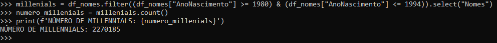

# Sprint 8
## Desafio
O desafio consistia em aplicar os conhecimentos adquiridos ao longo do Programa de Bolsas para transformar os arquivos nos formatos CSV e JSON em arquivos Parquet, organizando-os na camada Trusted. Essa camada é responsável por armazenar dados já tratados e confiáveis.

[Desafio](./Desafios/)

# Exercícios 
## Exercício - Geração e massas de dados
### Etapa 1
Nessa etapa 1, eu segui as instruções para criar o script conforme solicitado. Antes disso, testei para garantir que ele estava realmente imprimindo os dados ao contrário.

[etapa1.py](./Exercicios/Geração_e_massas_de_dados/etapa1.py)

### Etapa 2
Nessa etapa 2, eu só segui as instruções para criar o script conforme solicitado.

[etapa2.py](./Exercicios/Geração_e_massas_de_dados/etapa2.py)

Arquivo csv que foi gerado:
[animais.csv](./Exercicios/Geração_e_massas_de_dados/animais.csv)

### Etapa 3

Primeira coisa que fiz foi instalar a biblioteca names 

[evidencia5](./Evidencias/Evidencias_exercicios/evidencia5.png)

E depois, eu só segui as instruções para criar o script conforme solicitado.

[etapa3.py](./Exercicios/Geração_e_massas_de_dados/etapa3.py)

Arquivo txt que foi gerado:
Obs: não coloquei o arquivo aqui, pois ele é muito grande e o GitHub não comporta.

##
## Exercício - TMDB

Segui todas as etapas indicadas no curso da Udemy e me cadastrei no TMDB. Testei para garantir que estava tudo funcionando corretamente.
OBS: Por segurança, apaguei minha chave de acesso.

Escrevi o código que foi disponibilizado e o executei usando o comando:
python script.py.

[script.py](./Exercicios/TMDB/script.py)

##
## Exercício - Apache Spark 

A primeira coisa que fiz foi criar o script que seria rodado no PySpark. Segue o script abaixo:

[script_spark.py](./Exercicios/Apache_Spark/script_spark.py)

Depois disso, abri o Ubuntu e digitei o comando pyspark. Em seguida, comecei a colar linha por linha do código que fiz anteriormente.

Agora vou disponibilizar as respostas que obtive durante o exercício:

__Respostas da Etapa 2__
Ja fiz com que o schema tivesse o nome da coluna correto no começo definindo o schema.

__Respostas da Etapa 3__ 
Adicionei uma nova coluna chamada Escolaridade e atribuí valores de forma aleatória.

__Respostas da Etapa 4__
Adicionei uma nova coluna chamada País e atribuí o nome de um dos 13 países da América do Sul, de forma aleatória.

__Respostas da Etapa 5__
Adicionei uma nova coluna chamada AnoNascimento e atribuí valores aleatórios entre 1945 e 2010.

__Respostas da Etapa 6__
Selecionei as pessoas que nasceram neste século. Armazenei o resultado em outro dataframe chamado df_select e mostrei 100 nomes. Aqui cometi um erro, pois a instrução era para exibir apenas 10 nomes.

__Respostas da Etapa 7__
Na Etapa 7, utilizei o Spark SQL para realizar a mesma operação da Etapa 6.

__Respostas da Etapa 8__
Contei o número de pessoas que fazem parte da geração Millennials.

__Respostas da Etapa 9__
Na Etapa 9, utilizei o Spark SQL para realizar a mesma operação da Etapa 8.

__Respostas da Etapa 10__
Utilizei o Spark SQL para obter a quantidade de pessoas de cada país, separadas por geração. Armazenei o resultado em um novo dataframe e mostrei todas as linhas em ordem crescente de País, Geração e Quantidade.

E assim finalizei todas as etapas deste exercício.

## Opnião:
Achei esse desafio muito interessante! Apesar de ter enfrentado algumas dificuldades para criar um código que atendesse exatamente ao que foi solicitado, consegui resolver e executar com sucesso no final.

## O que aprendi?
1. Tutoriais Técnicos - Analytics
* Transformar os dados em insights
* Transformar e catalogar os dados com o AWS Glue
* Consultar os dados com o AWS Athena
* Visualizar os dados com o Amazon Quicksight