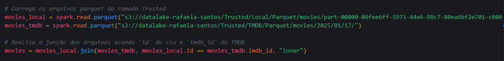
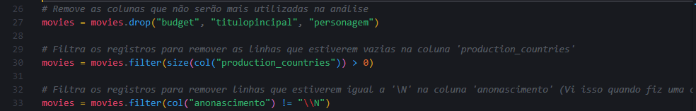
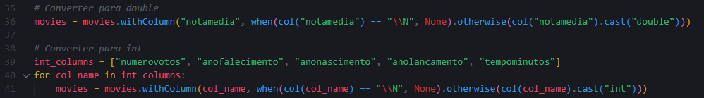
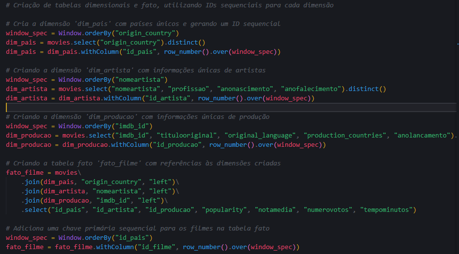
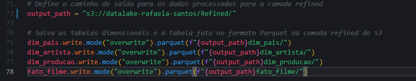
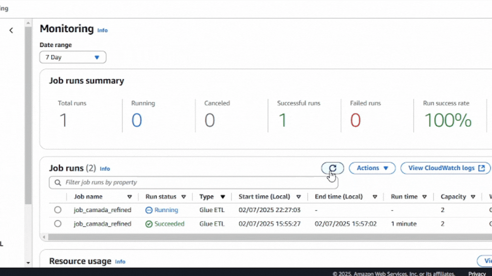

# Desafio 

# Perguntas

Primeiro, vou explorar a seguinte questão:

* Qual foi o ano em que mais filmes de Drama/Romance foram lançados?

A partir dela, pretendo expandir a análise com outras perguntas, como:

Incluí mais algumas possíveis perguntas na minha análise.

1. Quais são os 10 filmes mais bem avaliados no gênero Drama/Romance?
2. Quais são os 10 atores que mais participaram de filmes de Drama/Romance?
3. Quais são os 3 filmes mais votados no gênero Drama/Romance?
4. Qual é a média de idade dos atores que atuam em filmes de Drama/Romance?
5. Quais países mais produzem filmes de Drama/Romance?
6. Existe alguma correlação entre o país de origem e a popularidade (nota média ou número de votos)?
7. Qual a duração média dos filmes de Drama/Romance?
8. Filmes de quais países têm as maiores notas médias?
9. Como a popularidade dos filmes de Drama/Romance varia entre os países de produção?
10. Existe algum padrão entre o idioma original do filme e sua avaliação/popularidade?

Vou detalhar um pouco mais sobre as minhas questões.
1. Essa análise ajuda a identificar características específicas, como direção, enredo e elenco, que fazem um filme ser altamente avaliado. Também pode revelar tendências no gênero, como preferências por épocas ou diretores.

2. Destaca profissionais com carreiras prolíficas no gênero, ajudando a compreender a preferência da indústria cinematográfica por certos artistas e sua relevância nesse contexto.

3. Revela quais filmes tiveram maior popularidade ou impacto, indicando uma possível correlação entre marketing, distribuição e o interesse do público.

4. Ajuda a identificar o perfil demográfico predominante dos atores no gênero e mostra se existe uma faixa etária mais favorecida para papéis nesse tipo de produção.

5. Identifica os líderes globais na produção do gênero, evidenciando a contribuição cultural e regional para dramas e romances.

6. Revela possíveis vieses regionais na avaliação ou consumo de filmes, ajudando a entender como o público responde a produções com base no país de origem.

7. Mostra o padrão típico de duração para o gênero, ajudando na criação de produções que atendam às expectativas do público.

8. Destaca países reconhecidos pela qualidade de suas produções, seja por direção, roteiro ou outros fatores, ajudando a entender a percepção global de excelência no gênero.

9. Pode revelar quais países dominam o gênero e onde há maior aceitação do público.

10. Pode indicar se filmes em certos idiomas têm maior aceitação global ou regional. Também pode revelar se produções em inglês dominam o mercado ou se há espaço para outros idiomas crescerem.

#
### Modelagem Multidimencional
A primeira coisa que fiz para executar este desafio foi organizar a modelagem multidimensional. Para isso, utilizei o Athena para consultar minhas tabelas JSON e CSV, verificando quais colunas estavam disponíveis e separando as informações necessárias para a modelagem. 

Em seguida, usei o Notion para anotar a estrutura da tabela fato e das tabelas dimensão.

Antes de anotar no Notion, revisei as colunas que trouxe para a camada Trusted e decidi excluir algumas delas do diagrama e depois vou excluí-las para a camada refined. Removi a coluna budget, pois a maioria dos filmes não tinha esse valor preenchido. Também excluí a coluna tituloPrincipal, já que o tituloOriginal era suficiente para a análise. Além disso, descartei a coluna personagem, pois no início do processo eu já havia removido as linhas duplicadas que listavam todos os personagens de um filme. Analisar apenas um personagem por filme não faria sentido, então optei por excluí-la.

Depois disso, utilizei o draw.io, um programa com o qual já tenho familiaridade, para criar o diagrama conforme as instruções do desafio.

Para as ligações entre as tabelas, utilizei a relação __"1 optional to many mandatory"__, onde:

* Do lado do "1 optional", uma ocorrência da entidade __A__ pode ou não estar associada à entidade __B__, tornando sua participação na relação opcional.
* Do lado do "many mandatory", cada ocorrência da entidade __B__ deve estar associada a pelo menos uma ocorrência da entidade __A__, podendo estar vinculada a várias.

#
### Envia arquivos pra camada refined

A primeira coisa que fiz foi escrever o script para fazer todas as mudanças necessarias e enviar pra camada refined.

O script que escrevi é o seguinte:

[tabelas_camada_refined.py](./tabelas_camada_refined.py)

__SOBRE O CÓDIGO:__

Agora vou explicar um pouco sobre algumas partes importante do script que desenvolvi.

Aqui, o script carrega os arquivos Parquet que foram colocados na camada Trusted na sprint passada.
* movie_local: Variável que carrega os dados do arquivo CSV.
* movie_tmdb: Variável que carrega os dados extraídos da API TMDB.

Além disso, o script realiza uma junção (join) entre os DataFrames movies_local e movies_tmdb. A junção ocorre onde a coluna id de movies_local for igual à coluna imdb_id de movies_tmdb, que foram extraídas na sprint 7. Foi utilizada a estratégia de inner join, ou seja, apenas os registros que têm correspondência em ambas as tabelas são mantidos. O resultado dessa junção é armazenado no DataFrame movies.

Primeiramente, o script remove as colunas que não serão mais utilizadas. A decisão de exclusão foi baseada na análise dos dados no Athena:
* budget: A maioria dos filmes não possuía um valor registrado, o que inviabilizaria uma análise significativa.
* titulopincipal: Como a coluna titulooriginal já estava presente, não fazia sentido manter ambas.
* personagem: Após a reformulação das perguntas da análise, essa coluna deixou de ser relevante.

Em seguida, o script filtra os registros para remover as linhas onde a coluna production_countries está vazia. Essa decisão foi tomada após a análise dos dados no Athena, onde foi identificado que alguns registros não possuíam essa informação.

Por fim, o script também remove as linhas onde a coluna anonascimento estava vazia. Durante a análise no Athena, foi identificado que algumas dessas células continham o valor "\N", indicando ausência de informação.

Inicialmente, rodei o código sem essa parte, mas depois percebi que havia esquecido de alterar os tipos das colunas. Como os dados do CSV estavam todos como string, e eu precisaria realizar cálculos na análise, fiz a conversão necessária. A coluna notaMedia foi convertida para double, enquanto as demais colunas foram convertidas para int. Após essa correção, rodei o código novamente.

Para essa parte, utilizei o modelo dimensional que desenvolvi anteriormente e criei o código correspondente.

O código implementa o modelo dimensional no Apache Spark, criando três tabelas de dimensão:
* dim_pais
* dim_artista
* dim_producao

Cada tabela de dimensão é construída a partir do DataFrame movies, garantindo valores únicos e atribuindo chaves primárias (id_pais, id_artista e id_producao) usando row_number().

Em seguida, o código cria a tabela fato fato_filme, que referencia essas dimensões por meio de joins, incluindo métricas essenciais para análise, como:
* popularity
* notaMedia
* numeroVotos
* tempoMinutos

Por fim, é adicionada uma chave primária sequencial (id_filme) para os registros da tabela fato, garantindo a organização dos dados.

Essa parte, define o caminho de saída no Amazon S3 para armazenar os dados processados na camada Refined do Data Lake. Em seguida, ele salva os quatro DataFrames (dim_pais, dim_artista, dim_producao e fato_filme) no formato Parquet, sobrescrevendo dados existentes.

__EXECUÇÃO NO GLUE:__

Primeiro, utilizei o AWS Lake Formation para criar o banco de dados onde o crawler futuramente adicionará automaticamente uma tabela a partir dos dados armazenados no S3.

Depois disso, criei um novo job para processar o meu script. Para isso, segui as recomendações fornecidas nas instruções do desafio.

Após configurar o job, cliquei em Save.

Inseri o código no Glue e cliquei em Run para executar o job.

Fui até o Job Run Monitoring e acompanhei a execução.

Depois, fui até o S3 para verificar se o processo havia sido executado corretamente e se os arquivos estavam no caminho esperado.

Depois de concluir essas etapas, criei o Crawler para gerar uma tabela a partir dos dados armazenados no S3.

Aqui utilizei o mesmo IAM Role que foi criado no exercício de Glue da Sprint 7.

Em seguida, selecionei o Crawler que havia criado e cliquei em Run para executá-lo.

Após a execução, cliquei em Tables.

Depois em cada tabelas eu cliquei em Table Data e depois em Proceed, o que abriu o Athena com o comando SQL já gerado para realizar um SELECT.

Eu cliquei em Run again para confirmar se estava tudo correto, e esses foram os resultados obtidos:

